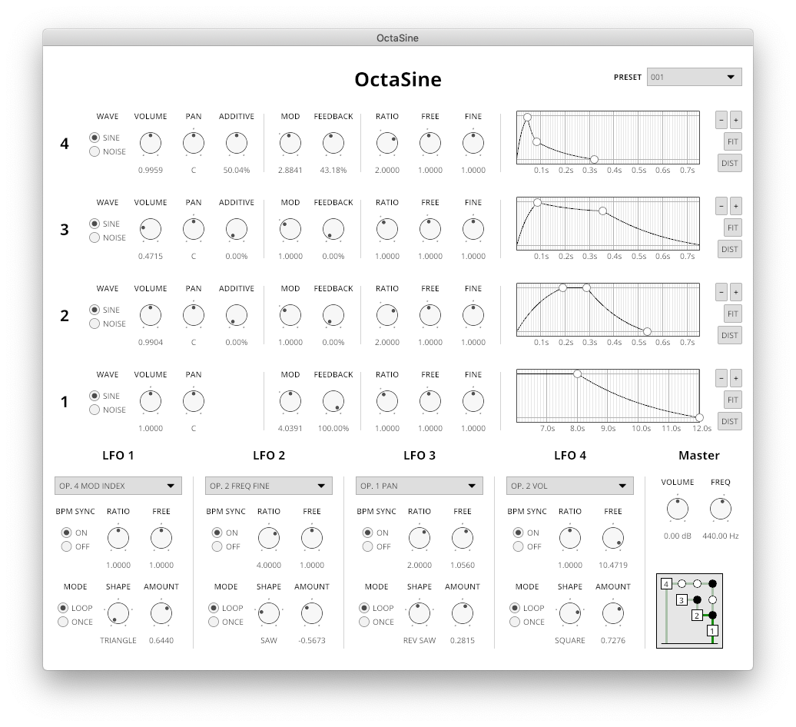

# OctaSine

VST2 frequency modulation synthesizer written in Rust.



Audio examples are available at [soundcloud.com/octasine](https://soundcloud.com/octasine).

## About

* Four operators with independent parameters such as volume, panning,
  modulation index, feedback, three different frequency modifiers (ratio, free
  and fine) and ADSR volume envelope parameters. The operators can be
  independently switched to white noise mode
* Flexible routing allowing setting the output operator (with some
  limitations) as well as the percentage of signal that is simply added to the
  final output, enabling additive synthesis. By default, operator 4 is routed
  to operator 3, operator 3 to operator 2 and operator 2 to operator 1.
* Master volume and master frequency parameters
* Four LFOs capable of targeting most operator parameters as well as
  most parameters of lower index LFOs.
* 128 voices (using them all simultaneously might consume quite a bit
  of CPU time though)
* Fully automatable

## Installation

### macOS

If you have already any of the software mentioned below, that step can be skipped.

1. [Install the Rust compiler](https://rustup.rs/). Choose the nightly toolchain when prompted. Requires the XCode build tools from Apple, you will probably be prompted to install those.

2. If you didn't install the nightly Rust toolchain in the last step, do it now:

```sh
rustup toolchain install nightly
```

3. [Install homebrew](https://brew.sh).

4. Install git and cmake with homebrew:

```sh
brew install git cmake
```

5. Clone this repository to a folder on your computer:

```sh
mkdir -p "$HOME/Downloads"
cd "$HOME/Downloads"
git clone https://github.com/greatest-ape/OctaSine.git
cd OctaSine
```

6. Build and install:

```sh
./scripts/macos/build-simd-and-install.sh
```

Finished!

Binary (pre-built) releases might be uploaded eventually.

### Other platforms

Have a look at the cargo invocations from the macOS section scripts, they
should work fine.

## Copyright and license

Copyright (C) 2019-2021 Joakim Frostegård

OctaSine is licensed under the GNU Affero General Public License, Version 3, as
published by the Free Software Foundation. See [LICENSE](LICENSE) for details.

Contents of the `contrib` directory are licensed under other terms. Please
refer to the contained directories and/or files for details.

## Notes

Depends on the following git repositories:

  * https://github.com/greatest-ape/sleef-sys (__octasine__ branch for static linking and avx instruction generation)

## Trivia

* The name OctaSine comes from the four stereo sine-wave operators
