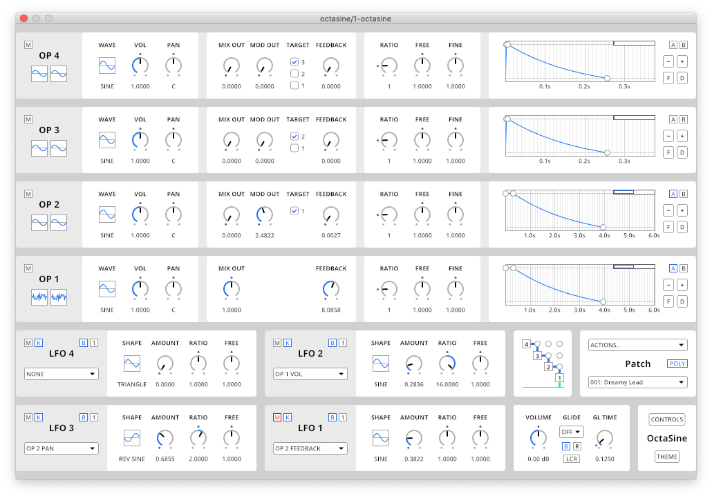
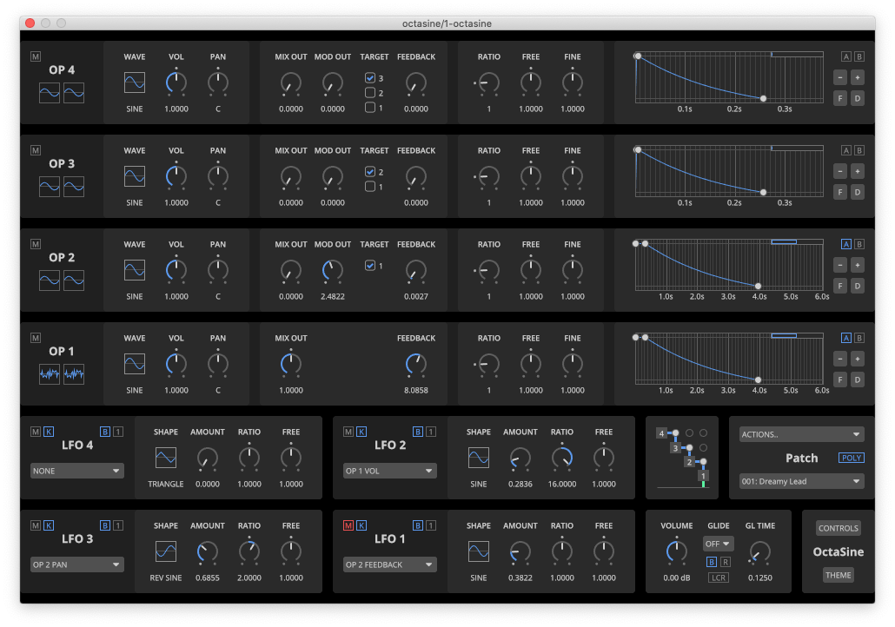

<h1 align="center">OctaSine</h1>

<p align="center">
Frequency modulation synthesizer plugin (VST2, CLAP). Runs on macOS, Windows and Linux.
</p>

<p align="center">
  <strong>Official website with downloads</strong><br>
  <a href="https://www.octasine.com">OctaSine.com</a>
</p>

<p align="center">
  <strong>Audio examples</strong><br>
  <a href="https://soundcloud.com/octasine">SoundCloud</a>
</p>


## Screenshots

### Light mode



### Dark mode



## Features

### Four operators

Four FM operators with parameters for wave form (sine or noise), volume, panning, feedback and frequency (ratio, free and fine), with visualizations of stereo wave forms after modulation.

### Flexible routing

Flexible routing allows setting the operator modulation targets (with some limitations) as well as the amount of signal that is simply added to the final output, enabling additive synthesis.

### Four LFOs

Four LFOs with multiple waveforms, oneshot and loop modes and optional DAW BPM sync. They can target most operator parameters and most parameters of lower-index LFOs.

### ADSR envelopes

Each operator is connected to an attack-decay-sustain-release volume envelope with logarithmic slopes. Envelope groups make synchronizing changes a breeze.

### Modulation panning

A unique feature of OctaSine is that modulation can be panned, enabling positioning FM within the stereo image. Additionally, true stereo panning is implemented, not just balance.

### Cross-platform

Runs on macOS (10.15 or later), Windows 10/11 and Linux (X11 only) in VST2- or CLAP-compatible DAWs on 64-bit computers. Synthesis is SIMD-accelerated on x86_64 (SSE2, AVX).

## Installation from source code

Please note that the recommended way to install OctaSine on macOS and Windows
is to [download an official release](https://www.octasine.com), not to build it from source.

### macOS

* [Install the Rust compiler](https://rustup.rs/). Choose the stable toolchain
  when prompted. The compiler requires Apple's XCode build tools. You will
  probably be prompted to install them.
* Install git unless it's already installed. If you're using [homebrew](https://brew.sh), run:

```sh
brew install git
```

* Clone this repository to a folder on your computer:

```sh
mkdir -p "$HOME/Downloads"
cd "$HOME/Downloads"
git clone https://github.com/greatest-ape/OctaSine.git
cd OctaSine
```

* Unless you want to use the bleeding edge development branch, switch to the latest stable version, e.g.:

```sh
git checkout tags/v0.8.3
```

* Build and install the plugin:

```sh
./scripts/macos/build-vst2-and-install.sh
./scripts/macos/build-clap-and-install.sh
```

### Windows

* Install [Microsoft C++ Build Tools](https://visualstudio.microsoft.com/visual-cpp-build-tools/). Make sure that the Windows 10 SDK and the English language pack components are included during installation.
* [Install the Rust compiler](https://rustup.rs/). When prompted, choose the stable toolchain and to modify the path variable.
* Install [git](https://git-scm.com/downloads).
* Clone this repository to a folder on your computer and enter it
* Unless you want to use the bleeding edge development branch, switch to the latest stable version, e.g.:

```sh
git checkout tags/v0.8.3
```

* Build and install the plugin:

```cmd
cargo xtask bundle octasine --release --features "vst2"
cargo xtask bundle octasine --release --features "clap"
```

* Copy `target\bundled\octasine.dll` to your VST plugin folder.
* Copy `target\bundled\octasine.clap` to your CLAP plugin folder.

### Linux

* [Install the Rust compiler](https://rustup.rs/). Choose the stable toolchain when prompted. 
* Install dependencies, e.g.,

```sh
sudo apt-get install cmake git build-essential libx11-dev libxcursor-dev libxcb-dri2-0-dev libxcb-icccm4-dev libx11-xcb-dev
```

On Debian 10, you might need to install some more dependencies:

```sh
sudo apt-get install pkg-config libfreetype6-dev libexpat1-dev
```

* Clone this repository to a folder on your computer, e.g.,

```sh
mkdir -p "$HOME/Downloads"
cd "$HOME/Downloads"
git clone https://github.com/greatest-ape/OctaSine.git
cd OctaSine
```

* Unless you want to use the bleeding edge development branch, switch to the latest stable version, e.g.:

```sh
git checkout tags/v0.8.3
```

* Build and install the plugin

```sh
cargo xtask bundle octasine --release --features "vst2"
cargo xtask bundle octasine --release --features "clap"
```

* Copy `target/bundled/octasine.so` to your VST plugin folder 
* Copy `target/bundled/octasine.clap` to your CLAP plugin folder 

## Architecture

See [ARCHITECTURE.md](ARCHITECTURE.md).

## Copyright and license

Copyright (C) 2019-2023 Joakim Frostegård

OctaSine is distributed under the GNU Affero General Public License, Version 3,
as published by the Free Software Foundation. See [LICENSE](LICENSE) for
details.

Contents of the `contrib` directory are licensed under other terms. Please
refer to the contained directories and/or files for details.
