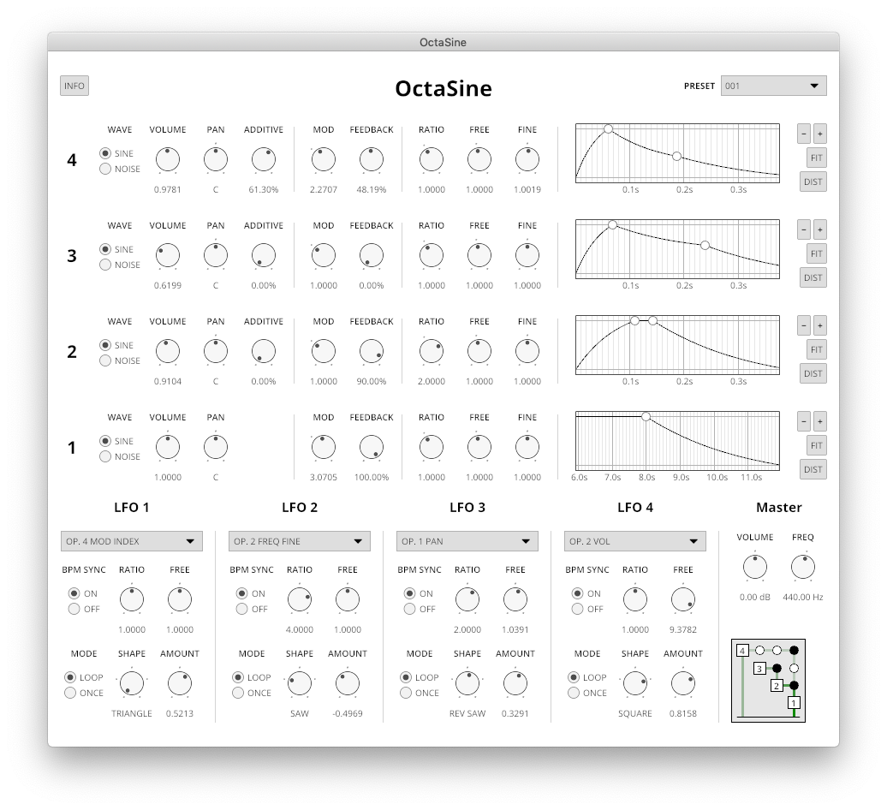

<h1 align="center">OctaSine</h1>

<p align="center">
VST2 frequency modulation synthesizer written in Rust.
</p>

<p align="center">
  <strong>Official website</strong><br>
  <a href="https://octasine.com">octasine.com</a>
</p>

<p align="center">
  <strong>Download latest</strong><br>
  <a href="https://github.com/greatest-ape/OctaSine/releases/download/v0.5.1/OctaSine-v0.5.1-macOS-Intel.zip">macOS (Intel)</a> • 
  <a href="https://github.com/greatest-ape/OctaSine/releases/download/v0.5.1/OctaSine-v0.5.1-Windows.zip">Windows</a>
</p>

<p align="center">
  <strong>Audio examples</strong><br>
  <a href="https://soundcloud.com/octasine">SoundCloud</a>
</p>

## Screenshot



## About

* Four FM operators with parameters for volume, panning, modulation index, feedback, frequency modifiers (ratio, free and fine), envelope values (attack, decay, release) and toggling of white noise mode.
* Flexible routing allows setting the operator modulation target (with some limitations) as well as the percentage of signal that is simply added to the final output, enabling additive synthesis.
* Four LFOs with multiple waveforms, oneshot and loop modes and optional DAW BPM sync. They can target most operator parameters and most parameters of lower-index LFOs.
* Each operator is connected to an attack-decay-sustain-release volume envelope with logarithmic slopes.
* Per-operator white noise mode makes it easy to create percussive sounds such as hi-hats and cymbals.
* Runs on macOS, Windows 10 and Linux in VST2-compatible DAWs. Synthesis is SIMD-accelerated where possible.
* Master volume and master frequency parameters
* 128 voices (using them all simultaneously might consume quite a bit of CPU time though)
* Fully automatable

## Installation

### macOS

1. Download the latest version from [the release page](https://github.com/greatest-ape/OctaSine/releases).
2. Unzip the file.
3. Move OctaSine.vst to your plugin folder, which is typically `/Library/Audio/Plug-Ins/VST/`. You may be promted to enter your administrative password.

### Windows

1. Download the latest version from [the release page](https://github.com/greatest-ape/OctaSine/releases).
2. Unzip the file.
3. Move OctaSine.dll to your plugin folder. You may be promted to enter your administrative password.

### Linux

Please refer to the section on installing from source below.

## Installation from source code

### macOS

If you already have any of the software mentioned below, that step can be skipped.

1. [Install the Rust compiler](https://rustup.rs/). Choose the nightly toolchain when prompted. Requires the XCode build tools from Apple, you will probably be prompted to install those.

2. [Install homebrew](https://brew.sh).

3. Install git and cmake with homebrew:

```sh
brew install git cmake
```

4. Clone this repository to a folder on your computer:

```sh
mkdir -p "$HOME/Downloads"
cd "$HOME/Downloads"
git clone https://github.com/greatest-ape/OctaSine.git
cd OctaSine
```

5. Build and install:

```sh
./scripts/macos/build-simd-and-install.sh
```

### Windows

If you already have any of the software mentioned below, that step can be skipped.

1. Install [Microsoft C++ Build Tools](https://visualstudio.microsoft.com/visual-cpp-build-tools/). Make sure that the Windows 10 SDK and the English language pack components are included during installation.
2. [Install the Rust compiler](https://rustup.rs/). When prompted, choose the nightly toolchain and to modify the path variable.
3. Install [cmake](https://cmake.org/download/). When prompted, choose the option to add cmake to the system executable path.
4. Install [git](https://git-scm.com/downloads).
5. Clone this repository to a folder on your computer.
6. Build OctaSine:

```cmd
cargo +nightly build --release --features "simd" -p octasine_vst2_plugin
```

7. Copy `target\release\octasine.dll` to your VST plugin folder.

### Linux

If you already have any of the software mentioned below, that step can be skipped.

1. [Install the Rust compiler](https://rustup.rs/). Choose the nightly toolchain when prompted. 
2. Install dependencies, e.g.,

```sh
sudo apt-get install cmake git build-essential libx11-dev libxcursor-dev libxcb-dri2-0-dev libxcb-icccm4-dev libx11-xcb-dev 
```

You might need to install llvm/clang dependencies too, e.g.,

```sh
sudo apt-get install llvm clang
```

On Debian 10, you might need to install some more dependencies:

```sh
sudo apt-get install pkg-config libfreetype6-dev libexpat1-dev
```

3. Clone this repository to a folder on your computer, e.g.,

```sh
mkdir -p "$HOME/Downloads"
cd "$HOME/Downloads"
git clone https://github.com/greatest-ape/OctaSine.git
cd OctaSine
```

4. Build the OctaSine plugin:

```sh
cargo +nightly build --release --features "simd" -p octasine_vst2_plugin
```

If build fails, please try building without sleef SIMD acceleration:

```sh
cargo +nightly build --release -p octasine_vst2_plugin
```

5. Copy `target/release/liboctasine.so` to your VST plugin folder 

## Architecture

See [ARCHITECTURE.md](ARCHITECTURE.md).

## Copyright and license

Copyright (C) 2019-2021 Joakim Frostegård

OctaSine is licensed under the GNU Affero General Public License, Version 3, as
published by the Free Software Foundation. See [LICENSE](LICENSE) for details.

Contents of the `contrib` directory are licensed under other terms. Please
refer to the contained directories and/or files for details.

## Trivia

* The name OctaSine comes from the four stereo sine-wave operators
